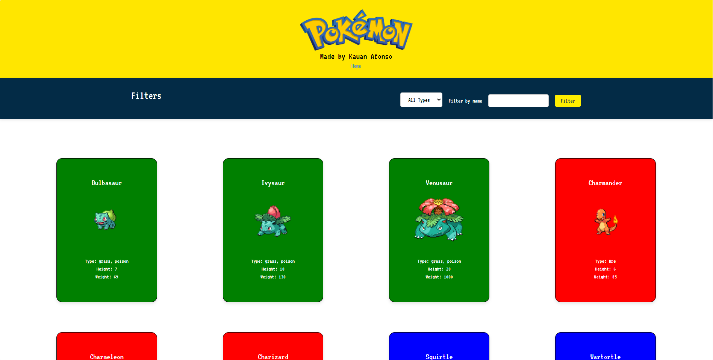

# 📘 Pokédex

Uma aplicação simples de **Pokédex** que consome a [PokéAPI](https://pokeapi.co/) e permite visualizar e filtrar Pokémons de forma prática e interativa.

---

## 🚀 Funcionalidades

- 🔎 **Filtro por nome** – encontre rapidamente o Pokémon que deseja.  
- 🌀 **Filtro por tipo** – selecione o tipo (fogo, água, grama, etc.) para exibir apenas os Pokémons correspondentes.  
- ➕ **Carregar mais** – clique em "Mais" para puxar mais resultados da API.  
- 🎨 Interface amigável com listagem dinâmica.  

---

## 🖼️ Prévia do Projeto

  


---

## 📂 Como rodar o projeto

1. Clone este repositório:
   ```bash
   git clone https://github.com/seu-usuario/seu-repo.git
